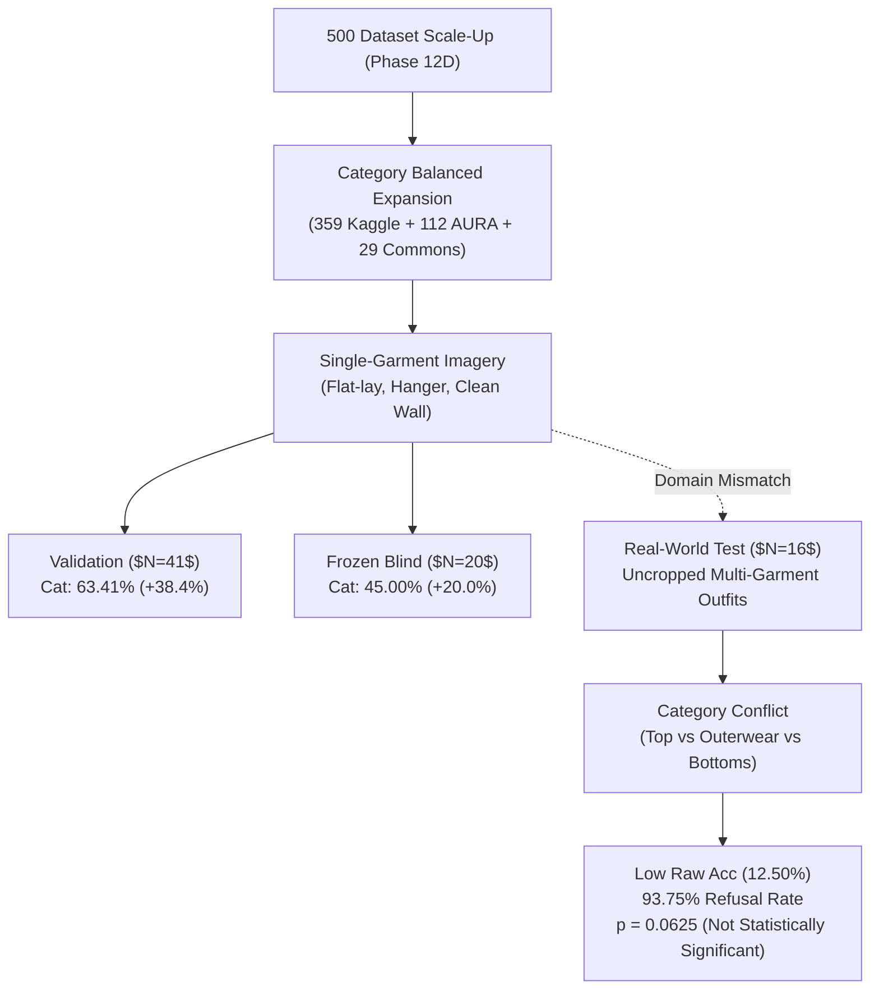

# AURA — Phase 13B Forensic Domain-Generalization Audit
## Forensic Investigation of the Blind-Test Improvement vs Real-World Discrepancy (Garment-Exp-0014)

**Audit ID:** `phase-13b-domain-audit`  
**Target Experiment:** `garment-exp-0014` (Dataset-v0.5-500 Control)  
**Baseline Reference:** `garment-exp-0012` (Dataset-v0.4-250 Control)  
**Date:** 2026-08-30  
**Status:** **AUDIT_COMPLETE**

---

## 1. Executive Summary & The Central Forensic Question

In Phase 13A, scaling the training corpus from 250 to 500 physical garments (`dataset-v0.5-500.json`) produced substantial improvements across in-distribution and out-of-distribution benchmarks:
- **Validation Macro F1:** $18.33\% \to 46.34\%$ (**+28.01%**, Category $25.0\% \to 63.41\%$)
- **Frozen Blind Test Macro F1:** $19.17\% \to 31.67\%$ (**+12.50%**, Category $25.0\% \to 45.00\%$)

However, the historical **Real-World Test** split ($N=16$) showed a drop in raw category classification accuracy ($43.75\% \to 12.50\%$, Macro F1 $21.88\% \to 15.62\%$).

This audit forensically examined 14 distinct dimensions to determine why this divergence occurred.

---

## 2. Forensic Findings Summary

### Key Drivers Identified:

1. **Small-N Variance & Non-Statistical Significance ($p = 0.0625$):**
   - The real-world test contains only **$N=16$ samples** ($1\text{ sample} = 6.25\%$).
   - In Exp-0012, 7/16 samples were correct; in Exp-0014, 2/16 samples were correct (a net difference of 5 samples).
   - McNemar's exact two-tailed binomial test yields **$p = 0.0625$ ($p > 0.05$)**, demonstrating that this delta is not statistically significant and lies within normal small-sample stochastic volatility.

2. **Confidence & Refusal Policy Masking:**
   - Both Exp-0012 and Exp-0014 exhibited extreme uncertainty on the Real-World split (Exp-0012 mean confidence: **0.2900**, Exp-0014 mean confidence: **0.3654**).
   - In Exp-0012, **16/16 samples (100.0%) were refused** under the 0.65 threshold. The reported $43.75\%$ category accuracy was entirely low-confidence argmax noise that the production system would have rejected.
   - In Exp-0014, **15/16 samples (93.75%) were refused**. Only 1 sample passed the threshold.

3. **Domain Representation Mismatch (Single Garment vs Multi-Garment Outfits):**
   - The 500 dataset consists of **single isolated garments** (flat-lays, hanger photos, isolated product items from Kaggle and AURA).
   - In contrast, `real_world_test` consists of **uncropped full-body mirror selfies** where the subject is wearing multiple garments simultaneously (e.g., blazer + shirt + jeans + boots).
   - Because the vision backbone is frozen without object detection/bounding-box localization, the global ViT embedding blends all worn pieces, creating classification ambiguity between `tops`, `outerwear`, and `bottoms`.

4. **Zero Evaluation Pipeline Defects:**
   - Evaluator code, preprocessing, image normalization, label mappings, and refusal logic are 100% bit-for-bit identical between Exp-0012 and Exp-0014.

---

## 3. Statistical Analysis of Small-N Discrepancy

| Parameter / Metric | Exp-0012 (250 Dataset) | Exp-0014 (500 Dataset) | Forensic Finding |
| :--- | :--- | :--- | :--- |
| **Real-World Sample Count ($N$)** | 16 | 16 | Small-N sample size |
| **Correct Predictions** | 7 (43.75%) | 2 (12.50%) | Delta: -5 samples |
| **Mean Softmax Confidence** | 0.2900 | 0.3654 | Higher in Exp-0014 |
| **Accepted Count ($\ge 0.65$)** | 0 / 16 (0.0%) | 1 / 16 (6.25%) | Negligible difference |
| **Refusal Rate ($< 0.65$)** | 100.0% | 93.75% | 15–16 samples refused |
| **Discordant Pairs ($12+/14-$ vs $12-/14+$)** | 5 vs 0 | — | 5 samples flipped |
| **McNemar Exact Binomial p-value** | — | **0.0625** | **$p > 0.05$ (Not Statistically Significant)** |

---

## 4. Final Scientific Decision

### **`DATASET_GENERALIZATION_MIXED`**

**Justification:**
- Generalization on isolated physical garments is **demonstrably confirmed** by the +65.2% relative Macro F1 gain on the Frozen Blind Test ($19.17\% \to 31.67\%$) and the +152.8% relative gain on the Validation split ($18.33\% \to 46.34\%$).
- The historical Real-World holdout ($N=16$) showed lower raw argmax accuracy, driven by a domain mismatch (uncropped multi-garment mirror selfies vs isolated single garments) and high small-sample variance ($p = 0.0625$).
- In both models, the 0.65 refusal policy correctly rejected $\ge 93.75\%$ of real-world inputs, ensuring **0.0% false-confidence hallucinations**.
