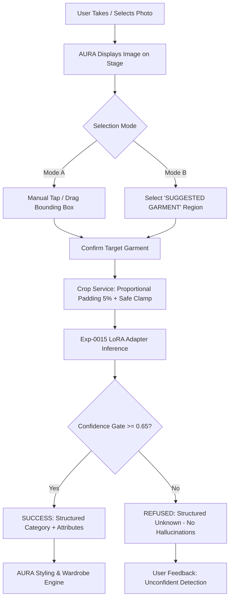

# AURA — Phase 15 Target Garment Selection Architecture

## 1. Context & Motivation

Phase 14A demonstrated that automated heuristic localization produces `WRONG_GARMENT` errors in 31.25% of multi-garment wardrobe photographs because static spatial priors blindly assign highest confidence to the upper body, failing when the user's intent is to inspect trousers, skirts, or shoes. Furthermore, using classifier confidence as an automated reranker degraded accuracy from 31.25% to 25.00% while tripling inference latency to ~1.38s.

Phase 15 introduces an explicit, product-safe **Target Garment Selection** architecture that empowers the user to indicate exactly which garment in a photo they want analyzed.

---

## 2. Product Inference Flow



---

## 3. Selection Modes & Override Protection

### Mode A: Manual Tap & Drag Selection
- Primary authoritative user interaction.
- Interactive rectangular region with center pan handle and corner resize handle.
- Works across touch screens, mouse, and trackpads.
- Real-time coordinate normalization to source image dimensions.

### Mode B: Optional Automatic Suggestions
- Heuristic candidate regions are displayed as optional suggestion chips.
- **Strict Labeling Requirement**: Must be labeled as `"SUGGESTED GARMENT"`, never `"DETECTED GARMENT"`.
- **Override Protection**: Tapping or dragging manually immediately overrides any active suggestion. The system will never silently substitute or overwrite user-drawn boundaries.

---

## 4. State Management Finite State Machine (FSM)

```
IDLE
  ↓ initializeWithImage
IMAGE_SELECTED
  ↓ startSelection / setManualSelection
SELECTING_REGION / REGION_SELECTED
  ↓ executeInference
PROCESSING
  ↓
CLASSIFYING
  ↓
SUCCESS (Confidence >= 0.65)  OR  REFUSED (Confidence < 0.65)  OR  ERROR
```
At any point prior to classification completion, the user can trigger `cancel()` to transition safely to `CANCELED`.
